# Overview
DC/OS Couchbase is an automated service that makes it easy to deploy and manage Couchbase on DC/OS.

## General Couchbase Triage Steps

1. Collect a DC/OS log bundle
2. Collect Scheduler logs - stderr & stdout.
3. Collect Node Logs - stderr & stdout.
Pro Tip: ​dcos task log --all couchbase-dev > couchbase-dev.log

## Couchbase Server general troubleshooting
Couchbase Troubleshooting: https://developer.couchbase.com/documentation/server/current/troubleshooting/troubleshooting-intro.html

### Couchbase Server Specific Logs
All logs from /var/lib/couchbase/logs

## General framework troubleshooting
https://docs.mesosphere.com/services/ops-guide/troubleshooting/

## Specific Scenarios:

### Scenario: node task becomes unresponsive

There are situations where a complete node replacement can become necessary, e.g the node task becomes unresponsive. We will use the `couchbase console` and the `dcos couchbase` cli to get things back to normal.

We first need to `failover` to the remaining couchbase nodes.

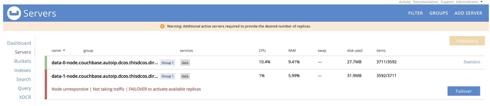

Confirm the failover request.

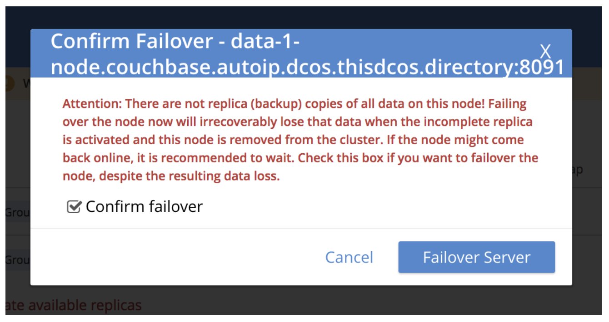

Once the failover is complete a `rebalance` is required.

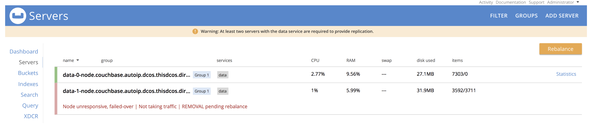

With that our ill node is removed from the couchbase cluster.

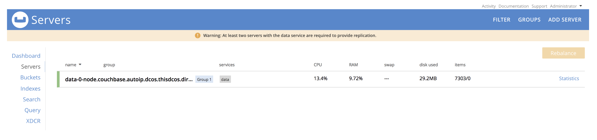

Next we use the `dcos cli` to replace the node by using the following command.

```
dcos couchbase pod replace data-1
```

Looking at the mesos console we see that data-1-node got killed and a new one created.

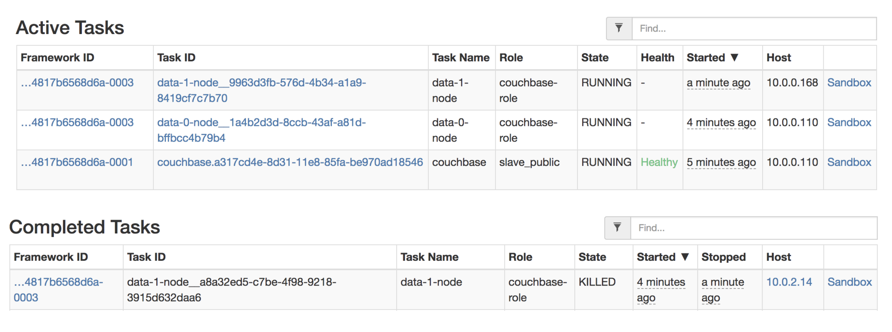

Back in the coucbase console we need to `add` the newly created node to the couchbase cluster. Since in our sample we replace a data node therefore select the `data checkbox` only.

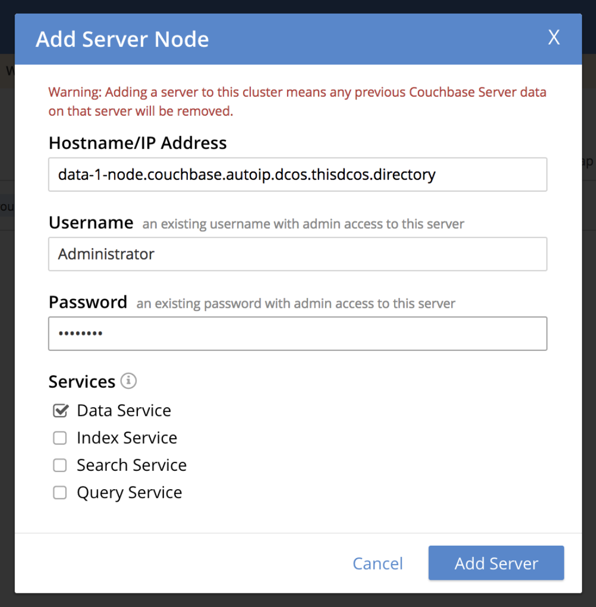

The node is added to the cluster and a another `rebalance` is required.

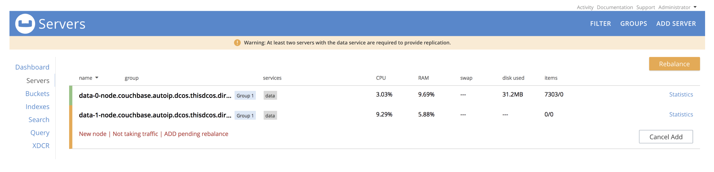

After that we are back to normal.

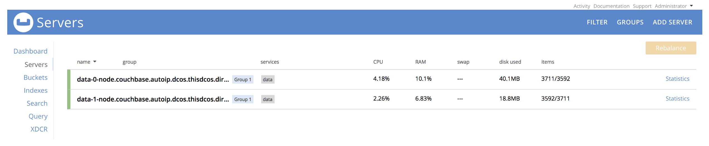


### Scenario: Backup and Restore

Sometimes it will be prudent to ask customer to backup their data (which can be restored later)

For backup and restore we leverage the `cbbackupmgr` tool that comes with Couchbase enterprise.

A dedicate `backpumgr service` node has to be launched, see respective section in the dcos couchbase service configuration. It provides the volume to store the incremental snapshots of the database, and provides tasks for the various `cbbackupmgr` commands (backup, restore, list, merge)

The backupmgr node is setup with a connection to an s3 compatible store (default is minio). The tasks use `aws s3 sync` command to keep the incremental snapshots on the backupmgr node and in the connected s3 bucket in sync.

**Note:** In your s3 compatible store you will have to create a bucket with the name that you specified in the backupmgr configuration.

### dcos couchbase plan start backupmgr-backup
Creates a incremental snapshot and syncs it with s3 bucket.

### dcos couchbase plan start backupmgr-restore
Syncs with s3 bucket then does the restore. Empty couchbase buckets have to be created before the restore.

### dcos couchbase plan start backupmgr-list
Lists the snapshots. You find it in the sdtout of the task.

### dcos couchbase plan start backupmgr-merge
The merge command allows you to merge snapshots together. Snapshots have a timestamp, you can get them via the list command.

```
dcos couchbase plan start backupmgr-merge -p MERGE_START=<start-time-stamp> -p MERGE_END=<end-time-stamp>
```

After the merge is completed it is also synced with the s3 bucket. After that both only contain the merged snapshot.

### Scenario: Identify Deployment Topology

Couchbase framework supports 2 deployment topologies:

1. In `Development deployment` Data nodes have all the Couchbase server service personalities (data, index, query, full text search, eventing, and analytics).

It is enabled by checking `all services enabled` in the `data service` section.

By default, Couchbase Server allows 80% of a node's total available memory to be allocated to the server and its services. In the data, index, fts, eventing , and analytics service configuration section ensure that `mem usable` is set so that the sum of them all is no more then 80% of memory configure for data services.

Service `counts` for index, fts, eventing , and analytics should be set to 0

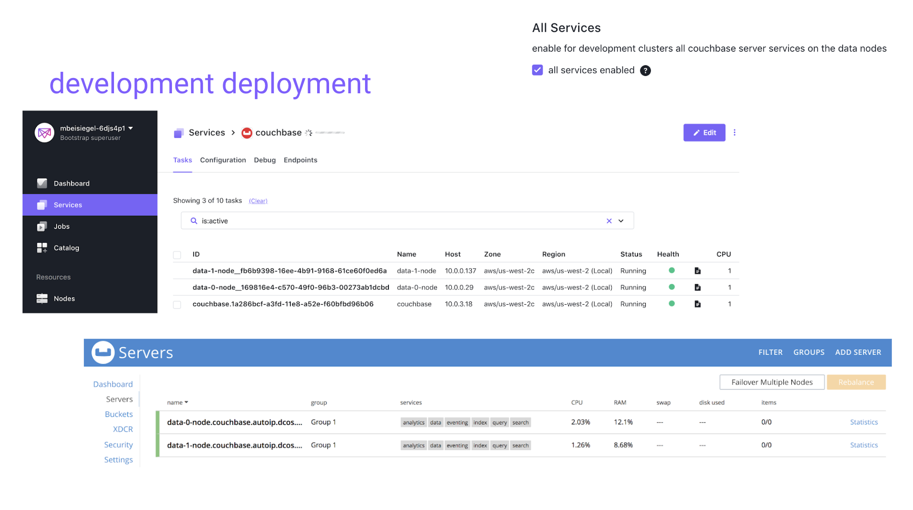

2. In `Production deployment` each Couchbase server service personality (data, index, query, full text search, eventing, and analytics) runs in its own container.

In the respective service personality configuration sections, you select the count you want. The following sample shows 2 data, 1 index, 1 query, 1 fts, 1 eventing, and 1 analytics service.


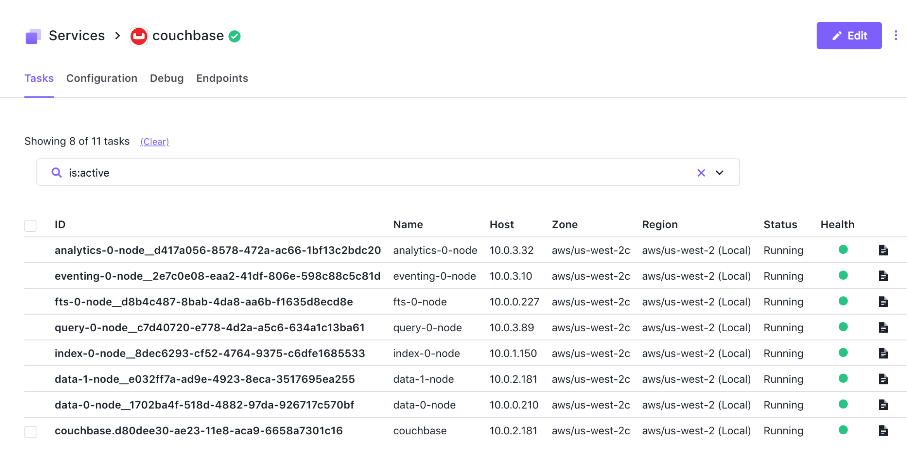

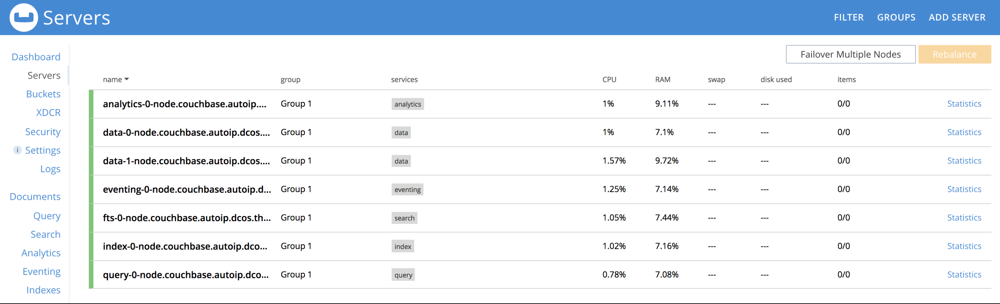

Since all Couchbase service nodes require the same ports, you will in the former sample, have to have a DC/OS cluster with 7 private agents.

`Higher density` can be achieved by using `virtual networking` where each container get its own IP. In combination with `placement constraints` you can then also colocate services on the same DC/OS agent as fits your specific needs.
