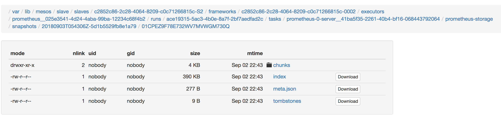

# Overview
DC/OS Prometheus is an automated service that makes it easy to deploy and manage Prometheus on DC/OS.

## General Prometheus Triage Steps

1. Collect a DC/OS log bundle
2. Collect Scheduler logs - stderr & stdout.
3. Collect Node Logs - stderr & stdout.
Pro Tip: ​dcos task log --all prometheus-dev > prometheus-dev.log

## General framework troubleshooting
https://docs.mesosphere.com/services/ops-guide/troubleshooting/

## Specific Scenarios:

### Scenario: Taking snapshots of Prometheus data

You can use a simple HTTP POST request to ask for a snapshot:

```
$ curl -XPOST http://localhost:9090/api/v1/admin/tsdb/snapshot
{"status":"success","data":{"name":"20180903T054405Z-2043c91c851f68cb"}}
```

Here a few seconds later it has returned the name of the new snapshot in a JSON object. If you look under the `snapshots` directory of your `data` directory you'll see this snapshot:

```
$ cd data/snapshots
$ ls
20180903T054405Z-2043c91c851f68cb
```



The snapshots are comprised of hard links of existing blocks, and a dump of the current open blocks
